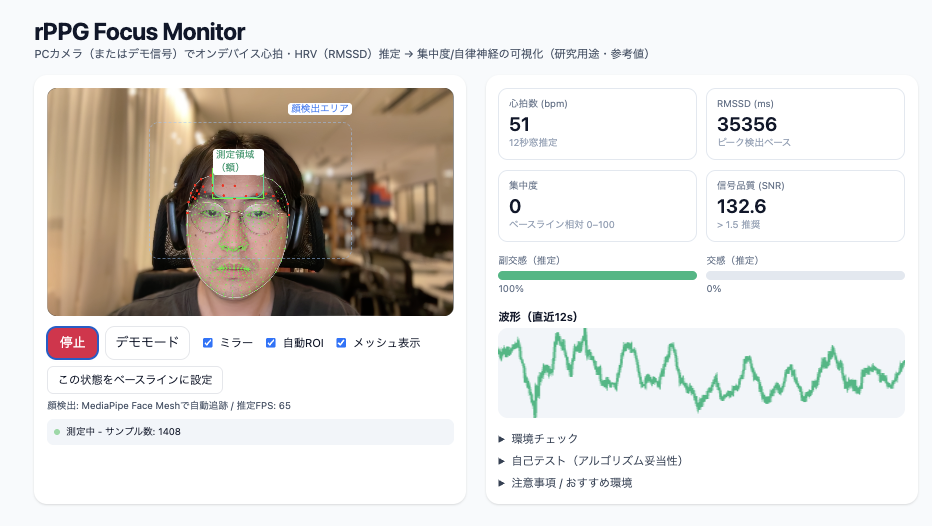

# rPPG Focus Monitor

[](https://github.com/hanamitsu/873ch.rPPG-Focus-Monitor/actions/workflows/deploy.yml)
[](https://opensource.org/licenses/MIT)

PCカメラを使用してリアルタイムで心拍数・心拍変動（HRV）を測定し、集中度や自律神経バランスを可視化するWebアプリケーション

🔗 **[Live Demo](https://hanamitsu.github.io/873ch.rPPG-Focus-Monitor/)**



## 🎯 概要

rPPG（remote Photoplethysmography：遠隔光電容積脈波記録法）技術を使用して、Webカメラから非接触で心拍数を推定します。顔の額領域の微細な色変化から血流を検出し、リアルタイムで以下を表示：

- **心拍数（BPM）** - 1分あたりの心拍数
- **RMSSD（HRV）** - 心拍変動の指標
- **集中度スコア** - ベースラインとの相対評価
- **自律神経バランス** - 交感神経/副交感神経の推定

## ✨ 特徴

### 🎭 MediaPipe Face Mesh統合
- 468点の顔ランドマークを使用した高精度な顔検出
- 眉間から上の額領域を自動追跡
- 瞬きの影響を受けない安定した測定

### 📊 リアルタイム信号処理
- **バンドパスフィルタ**: 0.7-3.0Hz（心拍の周波数帯域）
- **Goertzelアルゴリズム**: 効率的なスペクトル解析
- **ピーク検出**: 適応的閾値による心拍検出
- **RMSSD計算**: 連続するRR間隔の差の二乗平均平方根

### 🔧 デバッグ機能
- Face Meshオーバーレイ表示
- 測定領域の可視化
- リアルタイム波形表示
- 信号品質（SNR）インジケーター

## 🚀 使い方

### オンラインで使用

[https://hanamitsu.github.io/873ch.rPPG-Focus-Monitor/](https://hanamitsu.github.io/873ch.rPPG-Focus-Monitor/) にアクセス

### ローカルで実行

```bash
# リポジトリをクローン
git clone https://github.com/hanamitsu/873ch.rPPG-Focus-Monitor.git
cd 873ch.rPPG-Focus-Monitor

# 依存関係をインストール
npm install

# 開発サーバーを起動
npm run dev
```

## 📱 使用方法

1. **カメラ開始**ボタンをクリック
2. カメラへのアクセスを許可
3. 顔を画面中央に配置（緑の枠が額に重なるように）
4. 30秒〜1分静止して測定
5. 心拍数とHRVが安定したら測定完了

### コントロール

- **ミラー**: 映像を左右反転
- **自動ROI**: 顔追跡のON/OFF
- **メッシュ表示**: デバッグ用Face Mesh表示
- **ベースライン設定**: 現在の状態を基準値として記録

## 🔬 技術詳細

### アルゴリズム

#### 1. 顔検出と領域選択
```javascript
// MediaPipe Face Meshで眉間（ランドマーク9）を基準に
// 額の中央領域を自動選択
const glabellaY = landmarks[9].y;  // 眉間
const foreheadRegion = {
  top: glabellaY - eyebrowToTopDistance * 1.2,
  bottom: glabellaY,
  width: originalWidth * 0.5  // 中央50%に限定
};
```

#### 2. 信号抽出
- RGB値から緑チャンネルを使用（ヘモグロビンの吸収特性）
- 移動平均によるトレンド除去
- 2次IIRフィルタによるバンドパス処理

#### 3. 心拍数推定
- Goertzelアルゴリズムで0.7-3.0Hz帯域を解析
- スペクトルピークから心拍数を算出
- SNR（信号対雑音比）で品質評価

#### 4. HRV解析
- ピーク間隔（IBI）を検出
- RMSSD = √(mean(Δ(RR[i])²))
- 副交感神経活動の指標として使用

### パフォーマンス最適化

- **効率的な顔検出**: 0.5秒ごとの更新で負荷軽減
- **適応的サンプリング**: FPSに応じたフィルタ調整
- **WebGL活用**: Canvas描画の高速化
- **循環バッファ**: メモリ効率的なデータ管理

## 🛠️ 技術スタック

- **フレームワーク**: React 18
- **ビルドツール**: Vite
- **スタイリング**: Tailwind CSS
- **顔検出**: MediaPipe Face Mesh
- **信号処理**: カスタムDSPアルゴリズム
- **デプロイ**: GitHub Pages + GitHub Actions

## 📊 測定精度について

### 精度向上のための条件

- **照明**: 均一で明るい白色光
- **カメラ**: 30fps以上、HD解像度推奨
- **被験者**: 静止状態、正面向き
- **環境**: 振動や影の変化がない

### 制限事項

- 医療機器ではありません
- 診断目的には使用できません
- 参考値としてご利用ください
- 動きやメイクにより精度が低下する場合があります

## 🔮 今後の改善予定

- [ ] より高度な信号処理（CHROM, POS法）
- [ ] 呼吸数の同時測定
- [ ] ストレスレベルの推定
- [ ] データエクスポート機能
- [ ] PWA対応
- [ ] 多言語対応

## 📚 参考文献

1. Verkruysse, W., Svaasand, L. O., & Nelson, J. S. (2008). Remote plethysmographic imaging using ambient light.
2. De Haan, G., & Jeanne, V. (2013). Robust pulse rate from chrominance-based rPPG.
3. Wang, W., den Brinker, A. C., Stuijk, S., & de Haan, G. (2017). Algorithmic principles of remote PPG.

## 📄 ライセンス

MIT License - 詳細は[LICENSE](LICENSE)ファイルを参照

## 🤝 貢献

プルリクエストを歓迎します！大きな変更の場合は、まずissueを作成して変更内容について議論してください。

## ⚠️ 免責事項

本アプリケーションは研究・教育目的で開発されています。医療診断や治療の判断には使用しないでください。健康に関する懸念がある場合は、必ず医療専門家にご相談ください。

## 🙏 謝辞

- MediaPipe teamの素晴らしい顔検出ライブラリ
- rPPG研究コミュニティの先駆的な研究
- オープンソースコミュニティの支援

---

Made with ❤️ by [hanamitsu](https://github.com/hanamitsu)